# Manual de Usuario para Cliente (Versión No Técnica)

## ¿Qué es Archive Master?

Archive Master es una plataforma para organizar documentos de una empresa, controlar su estado, saber quién los tiene, generar reportes y mantener trazabilidad completa.

Tiene dos espacios principales:

- **Administración**: para configurar y gobernar el sistema.
- **Portal Operativo**: para el trabajo diario con documentos.

---

## Acceso por tipo de usuario

- Usuarios administrativos entran a: `/admin`
- Usuarios operativos entran a: `/portal`

Esto evita mezclar tareas técnicas con tareas diarias.

---

## Roles de usuario y qué hace cada uno

## 1) Super Admin

Puede ver y gestionar todo el sistema.

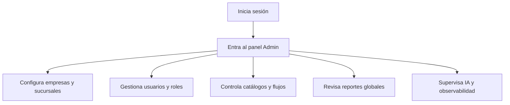

## 2) Admin

Administra su empresa y controla operación documental.

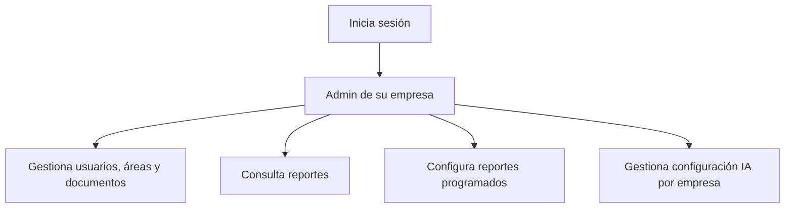

## 3) Branch Admin

Administra su sucursal con alcance limitado.

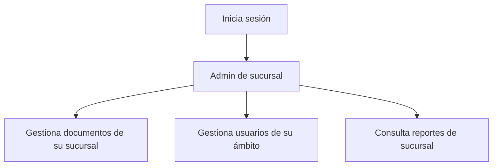

## 4) Office Manager

Controla documentos del área y participa en aprobaciones.

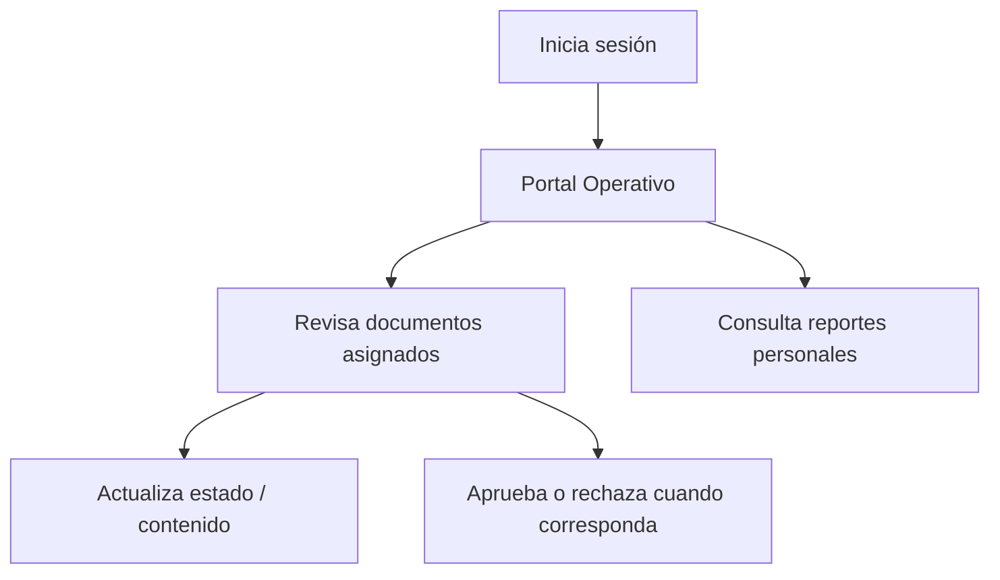

## 5) Archive Manager

Administra el archivo y consulta documentos en custodia.

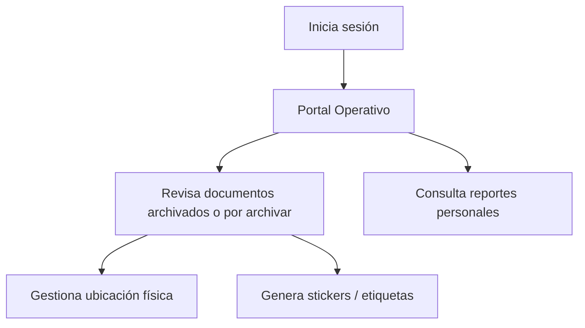

## 6) Receptionist

Registra documentos de entrada y genera recibidos.

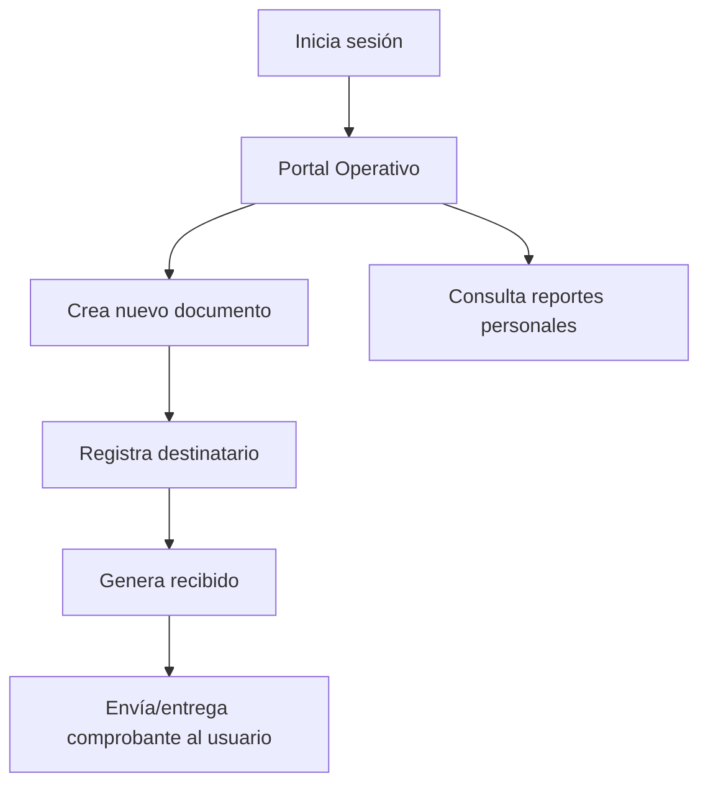

## 7) Regular User

Consulta sus documentos y recibidos.

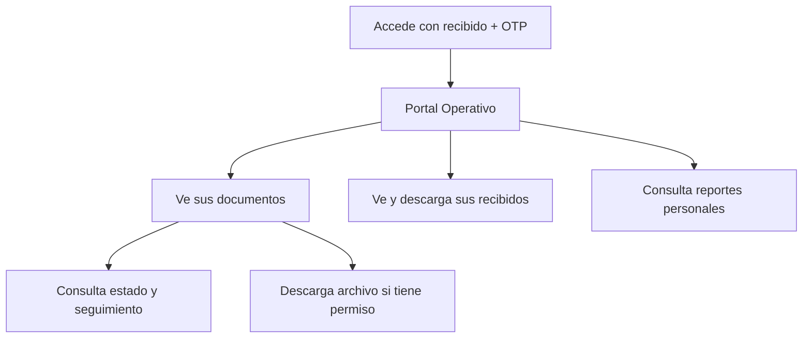

---

## Flujos principales del negocio (simple)

## Flujo A: Documento entrante

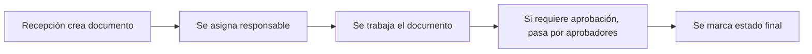

## Flujo B: Recibido + acceso del usuario final

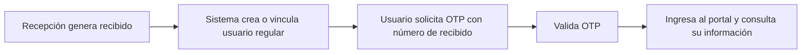

## Flujo C: Seguimiento público

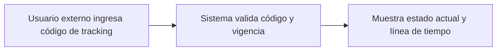

## Flujo D: IA sobre documentos

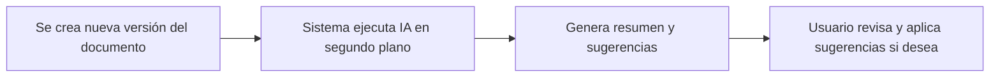

---

## Entradas y salidas que ve el cliente

Entradas típicas:

- formularios de documento
- carga de archivos
- datos de receptor para recibido
- código de tracking
- OTP para acceso portal

Salidas típicas:

- documentos y estados en pantalla
- reportes en PDF/Excel/CSV
- recibidos en PDF
- etiquetas/stickers con QR/barcode
- historial de cambios y trazabilidad

---

## Beneficios que puede validar el cliente

- Cada rol ve solo lo que necesita.
- El trabajo diario ocurre en un portal simple.
- El panel admin queda para control y configuración.
- Hay trazabilidad de acciones y cambios.
- Se pueden automatizar reportes y monitoreo.
- El sistema permite crecimiento por empresa/sucursal.

---

## Nota para presentación

Este documento está diseñado para explicar el sistema a negocio y usuarios finales.  
Para detalle técnico completo (API, políticas, jobs, seguridad interna), usar:

- `/Volumes/NAS(MAC)/Data/Herd/archive-master-app/MANUAL_USUARIO_SISTEMA.md`

